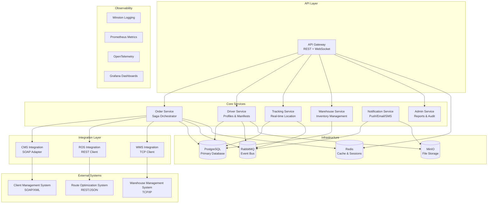

# SwiftTrack Architecture Overview

## System Architecture

SwiftTrack is built as a microservices architecture designed for scalability, fault tolerance, and maintainability. The system follows Domain-Driven Design (DDD) principles and implements several reliability patterns.



## Service Responsibilities

### API Gateway

- **Purpose**: Single entry point for all client requests
- **Responsibilities**:
  - Authentication and authorization
  - Request routing and load balancing
  - Rate limiting and throttling
  - WebSocket gateway for real-time communications
  - API documentation (OpenAPI/Swagger)
- **Technology**: NestJS with Express and Socket.IO

### Order Service

- **Purpose**: Core business logic for order management
- **Responsibilities**:
  - Order lifecycle management
  - Saga orchestration for distributed transactions
  - Status transition validation
  - Integration with external systems
- **Patterns**: Saga, Outbox, Event Sourcing
- **Technology**: NestJS with TypeORM

### Driver Service

- **Purpose**: Driver-related operations
- **Responsibilities**:
  - Driver profile management
  - Daily manifest generation
  - Route acknowledgment
  - Proof of Delivery (POD) handling
- **Technology**: NestJS with file upload support

### Tracking Service

- **Purpose**: Real-time location and tracking
- **Responsibilities**:
  - GPS location ingestion
  - Geofence event processing
  - Real-time updates to clients
  - Location history management
- **Technology**: NestJS with WebSocket events

### Warehouse Service

- **Purpose**: Warehouse and inventory operations
- **Responsibilities**:
  - Inventory tracking
  - Warehouse section/rack management
  - Arrival and departure logging
- **Technology**: NestJS with spatial queries

### Notification Service

- **Purpose**: Multi-channel notifications
- **Responsibilities**:
  - Push notifications (FCM)
  - Email notifications (SendGrid)
  - SMS notifications (Twilio)
  - Notification preferences
- **Technology**: NestJS with external service integrations

### Admin Service

- **Purpose**: Administrative operations
- **Responsibilities**:
  - Reporting and analytics
  - Audit trail management
  - Feature flag management
  - System monitoring dashboards
- **Technology**: NestJS with reporting libraries

## Integration Services

### CMS Integration (SOAP)

- **Purpose**: Interface with legacy Client Management System
- **Implementation**: SOAP client with XML marshalling/unmarshalling
- **Patterns**: Circuit Breaker, Retry with Exponential Backoff
- **Error Handling**: Dead Letter Queue for failed requests

### ROS Integration (REST)

- **Purpose**: Route optimization service integration
- **Implementation**: HTTP client with JSON payload
- **Patterns**: Circuit Breaker, Bulkhead, Timeout
- **Caching**: Route results cached for performance

### WMS Integration (TCP)

- **Purpose**: Real-time warehouse system communication
- **Implementation**: TCP socket client with custom protocol
- **Patterns**: Connection pooling, Heartbeat, Reconnection logic
- **Message Format**: JSON over TCP with length-prefixed frames

## Data Architecture

### Primary Database (PostgreSQL)

- **Purpose**: Transactional data storage
- **Schema**: Normalized relational schema with JSONB for flexibility
- **Features**:
  - ACID transactions
  - Full-text search
  - Spatial data support (PostGIS optional)
  - Connection pooling

### Cache Layer (Redis)

- **Purpose**: Performance optimization and session storage
- **Use Cases**:
  - User sessions and JWT refresh tokens
  - API response caching
  - Rate limiting counters
  - Temporary data storage

### Message Broker (RabbitMQ)

- **Purpose**: Asynchronous communication between services
- **Exchange Types**:
  - Topic Exchange: Domain events with routing
  - Fanout Exchange: Broadcast notifications
  - Direct Exchange: Point-to-point messaging
- **Patterns**: Publisher Confirms, Consumer Acknowledgments, Dead Letter Queues

### File Storage (MinIO/S3)

- **Purpose**: Object storage for files and documents
- **Use Cases**:
  - Proof of Delivery images
  - Driver documents
  - Report exports
  - Static assets

## Security Architecture

### Authentication

- **Method**: JWT (JSON Web Tokens)
- **Token Types**:
  - Access Token (15 minutes)
  - Refresh Token (7 days)
- **Storage**: Refresh tokens in Redis with rotation

### Authorization

- **Model**: Role-Based Access Control (RBAC)
- **Roles**: Client, Driver, Admin, System
- **Permissions**: Fine-grained resource and action-based
- **Implementation**: Guards and decorators in NestJS

### Data Protection

- **Encryption**: Argon2 for password hashing
- **Transport**: TLS 1.3 for all communications
- **Input Validation**: class-validator with sanitization
- **Rate Limiting**: Sliding window rate limiter

## Reliability Patterns

### Circuit Breaker

- **Implementation**: Opossum library
- **Configuration**: 50% failure rate threshold, 60s timeout
- **Services**: All external integrations (CMS, ROS, WMS)

### Saga Pattern (Orchestration)

- **Implementation**: Choreography with compensating transactions
- **Use Case**: Order processing workflow
- **Steps**: CMS registration → WMS allocation → ROS optimization → Driver assignment

### Outbox Pattern

- **Implementation**: Transactional outbox table
- **Purpose**: Ensuring event publication in distributed transactions
- **Relay**: Background service publishes events to message broker

### Retry Mechanism

- **Strategy**: Exponential backoff with jitter
- **Configuration**: 3 retries, 1s initial delay, 2x backoff factor
- **Implementation**: Axios interceptors and custom decorators

### Health Checks

- **Endpoints**: `/health` (liveness), `/ready` (readiness)
- **Dependencies**: Database, Redis, RabbitMQ, External Services
- **Implementation**: NestJS Terminus module

## Event Architecture

### Domain Events

```typescript
// Order Events
OrderCreated;
OrderStatusUpdated;
OrderAssigned;
OrderDelivered;
OrderFailed;

// Driver Events
DriverLocationUpdated;
DriverRouteUpdated;
DriverManifestUpdated;

// Integration Events
CmsOrderCreated;
RosRouteOptimized;
WmsInventoryUpdated;
```

### Event Flow

1. **Command Processing**: Service processes business command
2. **State Change**: Entity state is updated in database
3. **Event Generation**: Domain event is created and stored in outbox
4. **Event Publishing**: Background relay publishes event to message broker
5. **Event Consumption**: Interested services consume and react to events

## Monitoring and Observability

### Logging

- **Library**: Winston with structured JSON logging
- **Levels**: ERROR, WARN, INFO, DEBUG
- **Context**: Request ID, User ID, Correlation ID
- **Destinations**: Console, File, Centralized logging (optional)

### Metrics

- **System**: Prometheus with custom metrics
- **Types**: Counter, Gauge, Histogram, Summary
- **Categories**: Business metrics, Performance metrics, Error rates
- **Visualization**: Grafana dashboards

### Distributed Tracing

- **System**: OpenTelemetry
- **Spans**: HTTP requests, Database queries, External service calls
- **Context Propagation**: Trace context across service boundaries
- **Analysis**: Jaeger for trace visualization

### Alerting

- **Thresholds**: Error rate > 5%, Response time > 1s, Queue depth > 1000
- **Channels**: Email, Slack, PagerDuty (configurable)
- **Escalation**: Multi-level alerting based on severity

## Development Workflow

### Code Organization

- **Monorepo**: pnpm workspaces for dependency management
- **Packages**: Shared libraries for cross-cutting concerns
- **Services**: Independent deployable applications
- **Scripts**: Automation for development tasks

### Quality Assurance

- **Linting**: ESLint with TypeScript support
- **Formatting**: Prettier with Git hooks
- **Testing**: Jest for unit tests, Supertest for integration tests
- **Coverage**: Minimum 80% code coverage requirement

### Deployment

- **Containerization**: Docker for all services
- **Orchestration**: Docker Compose for development
- **Environment**: Environment-specific configuration
- **Migration**: Database migrations with rollback support

This architecture ensures scalability, maintainability, and reliability while following industry best practices for microservices design.
